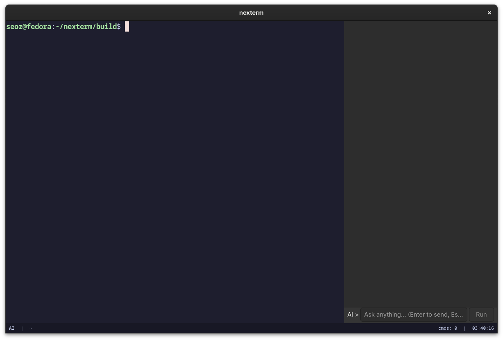

# nexterm

A GPU-accelerated terminal emulator for Linux with a built-in AI assistant — designed to make the terminal approachable for everyone, especially users coming from Windows.



## Why nexterm?

The terminal is the biggest barrier for Linux newcomers. nexterm solves this by embedding an AI assistant directly into the terminal experience. Instead of alt-tabbing to Google, you just press `Ctrl+Space`, ask your question in plain English, and get an explanation *and* a runnable command — no copy-pasting, no guessing.

## Features

- **GPU-accelerated rendering** via GTK4 + VTE
- **Built-in AI sidebar** — press `Ctrl+Space` to toggle
- **Explanation-first AI** — always explains before suggesting a command
- **One-click command execution** — Run button executes AI-suggested commands directly
- **TOML config file** — easy to read and edit, no cryptic syntax
- **Status bar** — shows mode, current directory, command count, and clock
- **Multiple AI backends** — Groq, Ollama, OpenAI, Anthropic, LiteLLM
- **Catppuccin Mocha** theme out of the box

## How it looks

```
┌───────────────────────┬──────────────────┐
│                       │                  │
│   your terminal here  │   AI sidebar     │
│                       │   (Ctrl+Space)   │
│                       │                  │
│                       │ AI > [ask here ] │
├───────────────────────┴──────────────────┤
│ NORMAL  │  ~  │  cmds: 4  │  14:32:01    │
└──────────────────────────────────────────┘
```

## Installation

### Dependencies

**Fedora:**
```bash
sudo dnf5 group install "Development Tools" -y
sudo dnf5 install gtk4-devel vte291-gtk4-devel libcurl-devel cmake -y
```

**Debian/Ubuntu:**
```bash
sudo apt install libgtk-4-dev libvte-2.91-gtk4-dev libcurl4-openssl-dev cmake build-essential -y
```

**Arch Linux:**
```bash
sudo pacman -S gtk4 vte4 curl cmake base-devel
```

### Build

```bash
git clone https://github.com/Abo-Alsuz/nexterm.git
cd nexterm
mkdir build && cd build
cmake ..
make -j$(nproc)
./nexterm
```

## Configuration

Config file lives at `~/.config/nexterm/nexterm.toml` and is created automatically on first run.

### AI backends

**Groq (free, fast, recommended):**
```toml
[ai]
backend  = "openai"
endpoint = "https://api.groq.com/openai/v1/chat/completions"
model    = "llama-3.3-70b-versatile"
api_key  = "gsk_your_key_here"
```
Get a free API key at [console.groq.com](https://console.groq.com)

**Ollama (local, no internet required):**
```toml
[ai]
backend  = "ollama"
endpoint = "http://localhost:11434/api/chat"
model    = "qwen2.5:7b"
api_key  = ""
```

**Anthropic Claude:**
```toml
[ai]
backend  = "anthropic"
endpoint = "https://api.anthropic.com/v1/messages"
model    = "claude-haiku-4-5-20251001"
api_key  = "sk-ant-your_key_here"
```

**Google Gemini:**
```toml
[ai]
backend  = "openai"
endpoint = "https://generativelanguage.googleapis.com/v1beta/openai/chat/completions"
model    = "gemini-2.0-flash"
api_key  = "your_gemini_key_here"
```

## Keybinds

| Keybind | Action |
|---|---|
| `Ctrl+Space` | Toggle AI sidebar |
| `Ctrl+Shift+C` | Copy |
| `Ctrl+Shift+V` | Paste |
| `Ctrl++` | Increase font size |
| `Ctrl+-` | Decrease font size |
| `Ctrl+0` | Reset font size |
| `Ctrl+Shift+N` | New window |
| `Esc` | Exit AI mode |

## Using the AI

1. Press `Ctrl+Space` — sidebar opens, mode switches to **AI**
2. Type your question and press `Enter`
3. AI responds with an explanation and a suggested command
4. Click **Run** to execute the command directly in your terminal
5. Press `Esc` to go back to **NORMAL** mode

### Example questions
- "how do I find files larger than 100MB?"
- "install kitty terminal"
- "what's eating my RAM?"
- "search /etc for environment variables"
- "how do I check open ports?"

## Built With

- **C++17**
- **GTK4** — window and UI
- **VTE** — terminal emulation (same engine as GNOME Terminal)
- **libcurl** — AI API requests
- **TOML** — configuration format

## License

MIT License — free to use, modify, and distribute.

## Author

**Abo-Alsuz** — built with the vision of making Linux accessible to everyone coming from Windows.
